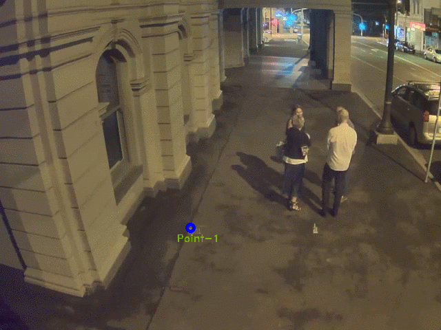

# Distance Estimation Feature
To calibrate the camera
```
./pedestrian_tracker -m_det '<path_to_model>' -m_reid 'path_to_model>' -i '<path_to_video>' -reconfig 'cam'
```
To use this feature
```
./pedestrian_tracker -m_det '<path_to_model>' -m_reid '<path_to_model>' -i '<path_to_video>' -th "<number_of_meter>"
```
Calculates the distance between every human who is detected in the frame.
Draw a line between humans who are between a threshold (1.5m) in this case.
As an extension feature to the pedestrian detection system. The distance estimation system allows the measurement between detected humans. Allowing users of the system to monitor whether pedestrians are practising social distancing. <br>
## Implementation Details
There are 3 stages for the implementation.
### Camera Calibration
Since the solution will be deployed in public places using either CCTV camera or raspberry pi camera (a monocular camera), the projection of a 3-D world scene into a 2-D perspective image plane leads to unrealistic pixel-distances between pedestrians (Yang et al. 2021). This is the perspective effect, where we can not perceive uniform distribution of distances in the entire image. For instance, pedestrians who are closer to the camera will be larger compared to those farther away from the camera. A well-known solution to this is to compute the homography or transformative matrix that morphs the perspective view into a bird’s-eye (top-down) view (Landing AI 2020). This is the process of calibrating the camera. Fortunately, Opencv has provided the functionality for computing such matrices.  The method involves choosing four points in the perspective view and map them to the bird’s eye view rectangle. This assumes that the surface is flat. Then another three points are selected for the scaling factor of the bird’s eye view. <br>
### Step by Step for Camera Calibration
Choose 4 points as followed (as shown in the gif)

)


Starting with the closest coordinates to the camera by forming the **width** first then **height**. Bottom-left(point-1) then bottom-right(point-2) to form the width. Next are bottom right(point-2) to top-right(point-3) for the width. Lastly, top-right(point-3) to top-left(point-4).
**Ensure that the four lines are parallel in real-life.**
Next are the 3 points. First the main point. Then the point for width distance from the main point. Lastly, the point for height distance from the main point.
**Ensure that the height distance and width distance are 1.5 meter in real-life.**

**Note**: The camera may not be position as shown in the gif, hence a good rule of thumb to configure the camera is to always mark the **width closest to the camera** first then the **the height**. This may take few trail and errors to get it just right.
### Pedestrian detection
This stage utilises the current AI system. 
### Measurement
Given the bounding boxes from the AI and the scaling factor from the camera calibration, we can estimate the distance between all detected pedestrians within the frame. The bottom-centres of each bounding box are used as a reference point for the calculation. The calculation uses the Euclidean distance formula. The system will show the estimation onto the frame when a threshold is below a certain amount.


## Reference 
- Ahmed, I., Ahmad, M., Rodrigues, J.J.P.C., Jeon, G. and Din, S. (2020). A deep learning-based social distance monitoring framework for COVID-19. Sustainable Cities and Society, p.102571.
‌Birla, D 2020, Social Distancing AI using Python, Deep Learning, Medium, viewed 20 August 2021, <https://blog.heyday.xyz/social-distancing-ai-using-python-deep-learning-c26b20c9aa4c>.
- Landing AI Creates an AI Tool to Help Customers Monitor Social Distancing in the Workplace 2020, Landing AI, viewed 1 August 2021, <https://landing.ai/landing-ai-creates-an-ai-tool-to-help-customers-monitor-social-distancing-in-the-workplace/>.
- Rezaei, M & Azarmi, M 2020, ‘DeepSOCIAL: Social Distancing Monitoring and Infection Risk Assessment in COVID-19 Pandemic’, Applied Sciences, vol. 10, no. 21, p. 7514.
Yang, D, Yurtsever, E, Renganathan, V, Redmill, KA & Özgüner, Ü 2021, ‘A Vision-Based Social Distancing and Critical Density Detection System for COVID-19’, Sensors, vol. 21, no. 13, p. 4608.


