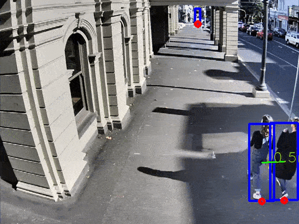

# Pedestrian Tracker C++


This module is adapted from pedestrian_tracker_demo module from Intel. For information on the original module and how it works, click [\[here\]](https://docs.openvinotoolkit.org/latest/omz_demos_pedestrian_tracker_demo_cpp.html).

# Contents <br>
1. [Dependencies](#dependencies)<br>
2. [Supported Models](#supported-models)<br>
3. [Installation](#installation)<br>
4. [Running](#running)<br>
5. [Logs Format](#logs-format)<br>


## Dependencies
OpenVino 2021.4 and its dependencies.
OpenVino 2021.4: [\[Link\]](https://software.seek.intel.com/openvino-toolkit) [\[Installation instruction\]](https://docs.openvinotoolkit.org/2021.4/omz_demos_pedestrian_tracker_demo_cpp.html)

## Supported Models
person-detection-retail-xxxx.

person-reidentification-retail-xxxx.

These models can be downloaded using [Intel Model Downloader](https://docs.openvinotoolkit.org/latest/omz_tools_downloader.html) or from [Intel Open Model Zoo.](https://github.com/openvinotoolkit/open_model_zoo)

## Installation
Start off by cloning the repository.Then
#### Building
```
cd pedestrian_tracker
mkdir build && cd build
cmake .
```
For linux based OS
```
make
```
For Windows
```
Open the generated .sln files and build via Microsoft Visual Studio 2019 or newer/MSBuild  
```
NOTE: `cmake .` will generate files for all submodules. Users can use cmake build flag to set build target to one sub-module only. See [\[here\]](https://cmake.org/cmake/help/latest/command/build_command.html).

### Adding http streaming
-The system uses cpp-mjpeg-streamer library (nadjieb/cpp-mjpeg-streamer) to stream the processed feed to localhost.

```
git clone https://github.com/nadjieb/cpp-mjpeg-streamer.git
```
#### Building
```
cd cpp-mjpeg-streamer
mkdir build && cd build
cmake .. 
make
sudo make install
```
#### Linking the library to the main system
Update the `CMakeLists.txt` in the `root` folder to the following

First is telling CMake to find the package
```
...
16 project(pedestrian_tracker)
17 find_package(nadjieb_mjpeg_streamer REQUIRED)
...
```
Then linking the library
```
...
108 add_executable(${IE_SAMPLE_NAME} ${IE_SAMPLE_SOURCES} ${IE_SAMPLE_HEADERS})
109 target_link_libraries(${IE_SAMPLE_NAME} PRIVATE nadjieb_mjpeg_streamer::nadjieb_mjpeg_streamer)
...
```
### Camera and Region of Interest Configuration
By using `-reconfig` after building the inital build of the application. **Camera and Region of Interest** can be configured by providing the necesscary keyword `"cam"` or `"roi"`. For more info on how to select the coordinates, please check out [\[Camera-Config\]](https://github.com/tienesphus/pedestrian_tracker/blob/master/docs/camera-config.md) and [\[ROI-Config\]](https://github.com/tienesphus/pedestrian_tracker/blob/master/docs/roi-config.md).

E.g. Configuring Region of Interest. <br>
NOTE:The system requires `-m_det`,`-m_reid`,`-i` as a bare **minimum** to run. For more info on the options, checkout [Running](#running).
```
./pedestrian_tracker -m_det 'models/person-detection-retail-0013.xml' -m_reid 'models/person-reidentification-retail-0288.xml' -i 'demo.mp4' -reconfig 'roi'
```
## Running
Running the application with the  `-h`  option yields the following usage message:

```
InferenceEngine:
    API version ............ <version>
    Build .................. <number>

pedestrian_tracker_demo [OPTION]
Options:

    -h                           Print a usage message.
    -i                           Required. An input to process. The input must be a single image, a folder of images, video file or camera id.
    -m_det "<path>"              Required. Path to the Pedestrian Detection Retail model (.xml) file.
    -m_reid "<path>"             Required. Path to the Pedestrian Reidentification Retail model (.xml) file.
    -location                    Required when -out flag is present. Specify value for location field in log file. 
    -loop                        Optional. Enable reading the input in a loop.
    -first                       Optional. The index of the first frame of the input to process. The actual first frame captured depends on cv::VideoCapture implementation and may have slightly different number.
    -read_limit                  Optional. Read length limit before stopping or restarting reading the input.
    -o "<path>"                  Optional. Name of the output file(s) to save.
    -limit "<num>"               Optional. Number of frames to store in output. If 0 is set, all frames are stored.

    -l "<absolute_path>"         Optional. For CPU custom layers, if any. Absolute path to a shared library with the kernels implementation.
          Or
    -c "<absolute_path>"         Optional. For GPU custom kernels, if any. Absolute path to the .xml file with the kernels description.
    -d_det "<device>"            Optional. Specify the target device for pedestrian detection (the list of available devices is shown below). Default value is CPU. Use "-d HETERO:<comma-separated_devices_list>" format to specify HETERO plugin.
    -d_reid "<device>"           Optional. Specify the target device for pedestrian reidentification (the list of available devices is shown below). Default value is CPU. Use "-d HETERO:<comma-separated_devices_list>" format to specify HETERO plugin.
    -r                           Optional. Output pedestrian tracking results in a raw format 
    -pc                          Optional. Enable per-layer performance statistics.
    -no_show                     Optional. Don't show output.
    -delay                       Optional. Delay between frames used for visualization. If negative, the visualization is turned off (like with the option 'no_show'). If zero, the visualization is made frame-by-frame.
    -out "<path>"                Optional. The file name to write output log file with results of pedestrian tracking. The format of the log file is
    -out_a						 Optional. Generate an additional log file which contains average time each detected person spent inside the region of interest. 
    -u                           Optional. List of monitors to show initially.
    -th                          Optional. Threshold for distance estimation.
    -reconfig                    Optional. 'cam' for re-calibrate camera or 'roi' for re-config the region of interest.
    -stream                      Optional. Stream the feed to localhost:8080.
```
##### Example 
```
./pedestrian_tracker -m_det 'models/person-detection-retail-0013.xml' -m_reid 'models/person-reidentification-retail-0288.xml' -i 'demo.mp4'
```
This command will launch pedestrian_tracker to process 'demo.mp4' using `models/person-detection-retail-0013.xml` as its detection model and `models/person-reidentification-retail-0288.xml` as its reidentification model.
Note: in the example above `models` folder and `demo.mp4` file are in the same folder as pedestrian_tracker binary. Absolute filepaths can also be used.

##### Pedestrain detection, tracking and output logs
There are two  flags for using log `-out` and `-out_a`. Please refer to [Logs Format](#logs-format) for more info.
```
./pedestrian_tracker -m_det 'models/person-detection-retail-0013.xml' -m_reid 'models/person-reidentification-retail-0288.xml' -i 'demo.mp4' -out '<path_to_file>'
```
##### Pedestrain detection, tracking and distance estimation
The system requires camera configuration before distance estimation can be used. Please refer to [Camera and Region of Interest Configuration](#camera-and-region-of-interest-configuration)

`-th` can then be used to specific the distance estimation's threshold. If the configuration is done correctly, the system would draw a line and display the distance in **meter** between pedestrains whose distance are below the threshold. In the command below `-th` is given "1.5" meaning 1.5 meter threshold.
```
./pedestrian_tracker -m_det 'models/person-detection-retail-0013.xml' -m_reid 'models/person-reidentification-retail-0288.xml' -i 'demo.mp4' -th "1.5"
```
## Logs Format

`-out` flag:
```
frame_no | real_time | person_id | x_coord | y_coord | width | height | confidence_level | location | uuid
```

- **real_time**: real time data when that particular data entry is logged.

- **person_id**: an integer id that uniquely identifies a tracked person.  **person_id** data transfers across frames which means if a tracked person with id 1 goes out of frame, id 1 will never be used again or be assigned to any other person. 

- **confidence_level**: a float number (0 to 1) detection model gives every tracked person that indicates the detection confidence level for that particular person.

- **location**: location of the system which is the value that is passed to the -location flag.

- **uuid**: a unique id is generated, each time the program runs.
The program writes to its log file every 100 frames when `-out` flag is called.
The `-out` flag produces an additional log. The direction log of each pedestrains.
```
person_id | direction | location
```
- **person_id**: an integer id that uniquely identifies a tracked person. 
- **direction**: the direction of pedestrains relative to the camera. The value can be left,right,forward,backward.
- **location**: location of the system which is the value that is passed to the -location flag.
**Note**: The program won't log the direction every 100 frames, the direction log file will be produced at the end when the video is finished.

`-out_a` flag:
```
person_id | initial_time | time_spent_in_roi | location
```
- **person_id**: an integer id that uniquely identifies a tracked person. 

- **initial_time**: Real time data when that person enters ROI.
- **time_spent_in_roi**: time each person spent in the region of interest.
- **location**: location of the system which is the value that is passed to the -location flag.

The program writes to its log file every 100 frames when `-out_a` flag is called.

## Re-configure the AI
This AI has been configured to maximise the accuracy for one specific counting context: Beswick Square.

It is **highly recommended**  for users to re-configure thresholds and sensitivities of the AI (by trial and error) when this project is used for a different counting context to achieve optimal accuracy level.

To re-configure thresholds and sensitivities of the AI, change the following:
In `tracker.cpp`:
```
min_track_duration

forget_delay

aff_thr_fast

aff_thr_strong

shape_affinity_w

motion_affinity_w

time_affinity_w

min_det_conf

bbox_aspect_ratios_range

bbox_heights_range

predict

strong_affinity_thr

reid_thr

drop_forgotten_tracks

max_num_objects_in_track.
``` 
In `detector.hpp`:
```
confidence_threshold
```
Instruction on how these variables affect the way this AI detects can be found in `tracker.hpp` and `detector.hpp` respectively.


